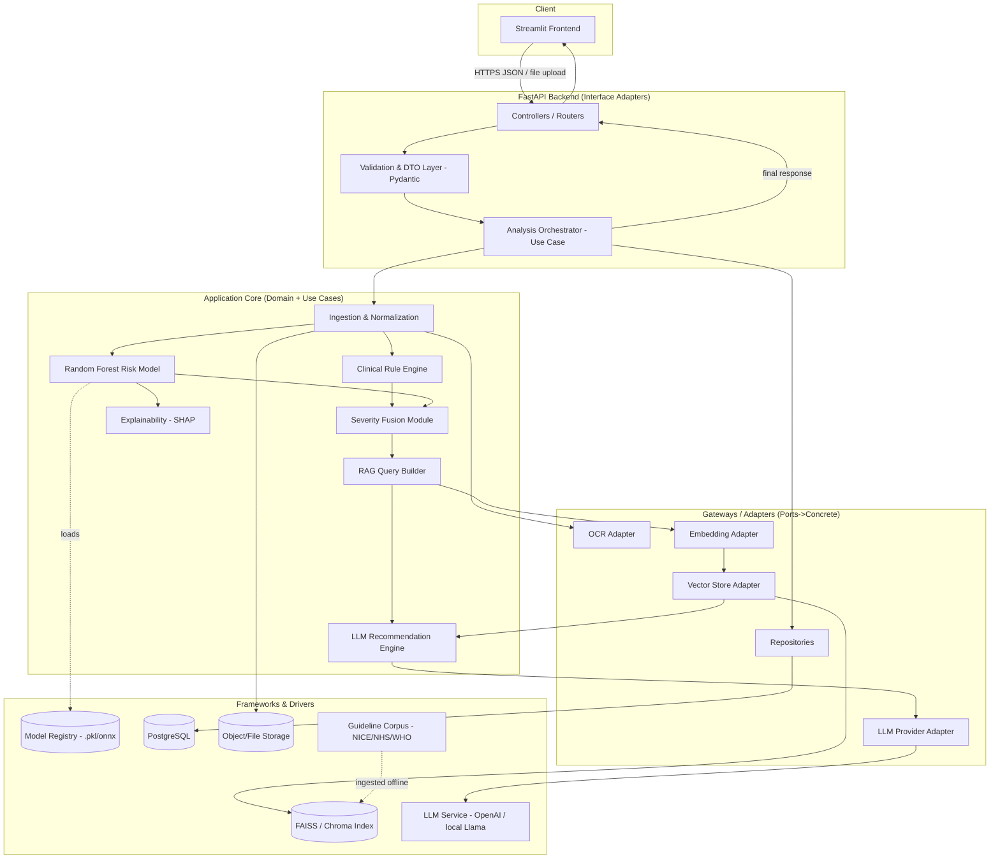
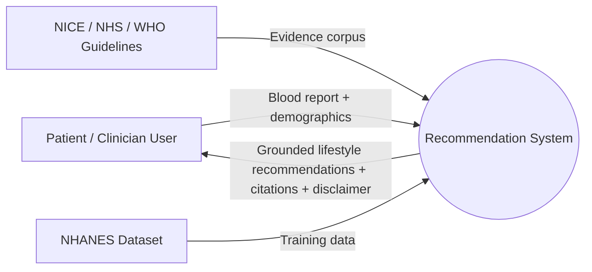
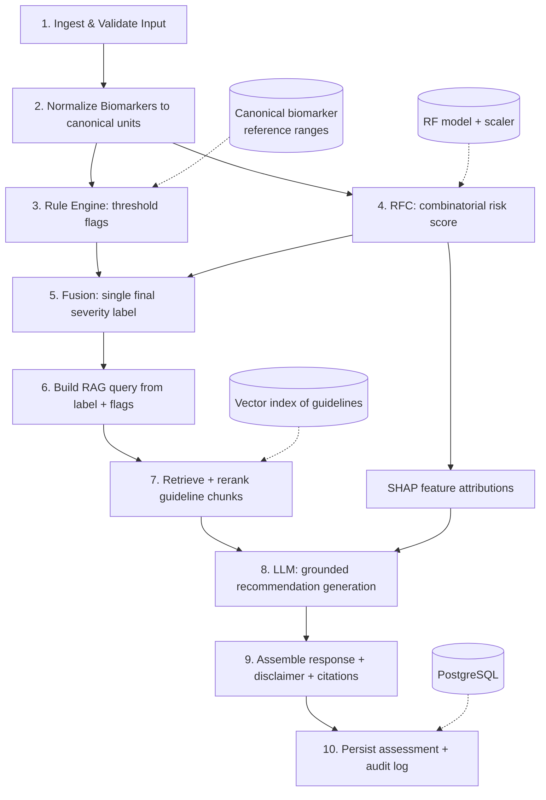
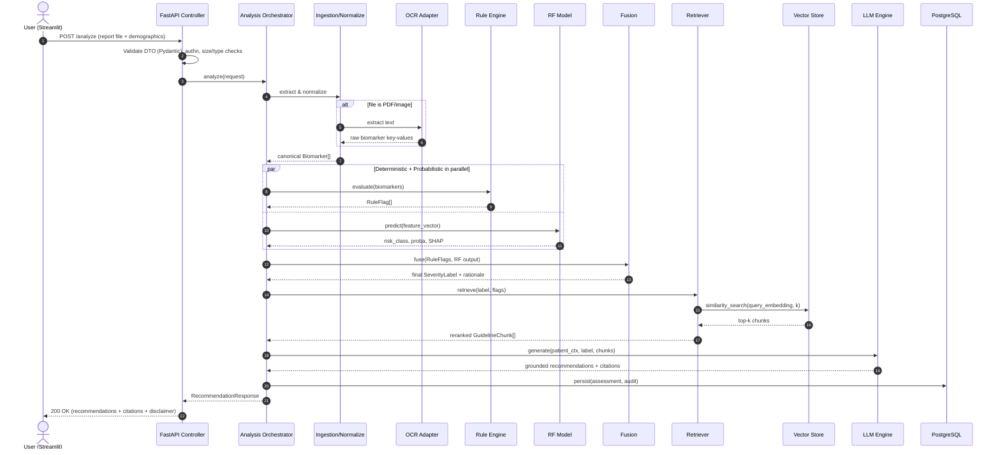
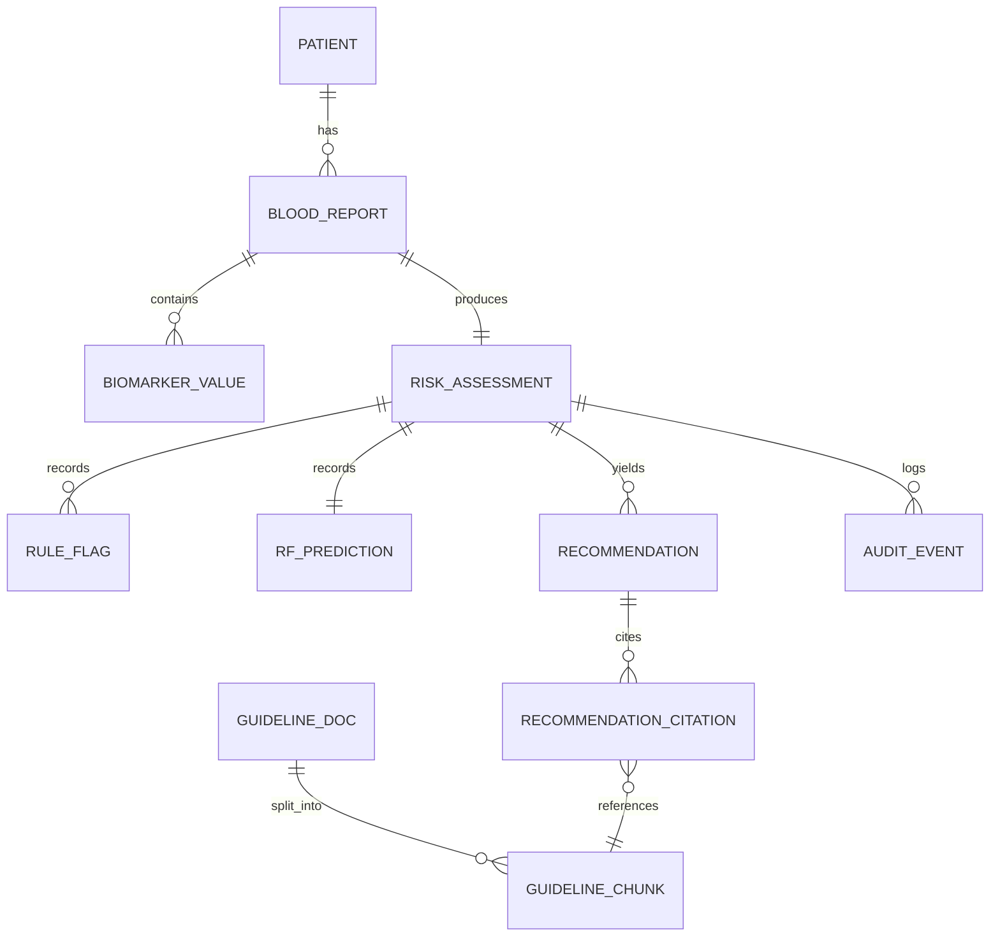

# Phase 1: Architecture design

**Project:** Personalized Lifestyle Recommendation System Based on Blood Test Reports Using Machine Learning, Retrieval-Augmented Generation (RAG), and Clinical Guidelines

**Author:** Bhavesh Bhargava, MSc Advanced Data Science

**Document version:** 1.0

This is the design written at the start of the project. It's kept as it was
planned, and section 11a lists where the finished system differs.

> The system is not a diagnostic tool. It gives lifestyle recommendations based
> on NICE, NHS and WHO guidance.

---

## 1. Design principles

The design follows Clean Architecture, where source code dependencies only point
inwards towards the domain, together with the SOLID principles:

| Principle | How it's applied |
|---|---|
| **Single responsibility** | Each module has one job. The rule engine checks thresholds, the Random Forest predicts combined risk, fusion merges the two, RAG retrieves, and the LLM layer explains. |
| **Open/closed** | New biomarkers and rules are added in configuration, not in engine code. New guideline sources are added by putting documents into the ingestion step. |
| **Liskov substitution** | `LLMProvider`, `VectorStore`, `Retriever` and `OCRExtractor` are abstract ports, so implementations can be swapped (OpenAI or a local Llama, FAISS or Chroma). |
| **Interface segregation** | Small, specific ports such as `IEmbedder` and `IReranker` instead of one large "AI service" interface. |
| **Dependency inversion** | The domain and use cases depend on ports. Concrete adapters (FastAPI, FAISS, OpenAI, PostgreSQL) are plugged in at the edges. |

### 1.1 Layers

```
┌───────────────────────────────────────────────────────────────┐
│  FRAMEWORKS & DRIVERS (outer)                                   │
│  Streamlit UI · FastAPI · PostgreSQL · FAISS/Chroma · LLM API   │
│  OCR engine · File storage · Logging/monitoring                 │
├───────────────────────────────────────────────────────────────┤
│  INTERFACE ADAPTERS                                             │
│  Controllers · DTOs/schemas (Pydantic) · Repositories ·         │
│  Gateways (LLM adapter, VectorStore adapter, OCR adapter)       │
├───────────────────────────────────────────────────────────────┤
│  APPLICATION / USE CASES                                        │
│  AnalyzeReport · EvaluateRules · PredictRisk · FuseSeverity ·   │
│  RetrieveGuidelines · GenerateRecommendation · PersistResult    │
├───────────────────────────────────────────────────────────────┤
│  DOMAIN / ENTITIES (inner, no external deps)                    │
│  Patient · Biomarker · BloodReport · RiskAssessment ·           │
│  SeverityLabel · GuidelineChunk · Recommendation                │
└───────────────────────────────────────────────────────────────┘
```

Dependencies only point inwards. The domain doesn't know about FastAPI, FAISS or
any LLM vendor, which is what makes the model replaceable and the results
reproducible.

---

## 2. Overall architecture

The system is a pipeline of modules behind a REST API, with a separate UI. Two
independent checks run on each report and are then combined:

1. **Rule engine (deterministic).** Flags any single biomarker past a threshold,
   for example HbA1c ≥ 48 mmol/mol. Every flag can be explained and traced to a
   guideline.
2. **Random Forest (probabilistic).** Picks up combinations of borderline results
   that pass every rule individually but together point to higher risk, for
   example high-normal glucose with low HDL, high triglycerides and a large waist.

The two results are merged into one severity. That severity is used to retrieve
passages from the guideline knowledge base, and the LLM writes patient-friendly
recommendations from those passages.

### 2.1 The five stages

```
Stage 1  Rules    → per-biomarker flags   (single thresholds)
Stage 2  RF       → combined risk         (patterns no single rule catches)
Stage 3  Fusion   → one severity          (max/priority merge, with a rationale)
Stage 4  RAG      → guideline passages    (retrieved using that severity)
Stage 5  LLM      → recommendations       (written from the passages)
```

Each stage has a typed input and output (a Pydantic or domain object), so the
stages can be tested on their own and replaced independently.

---

## 3. Component diagram



The system has an offline part and an online part:
- **Offline (build time):** guideline ingestion, chunking, embedding and indexing,
  plus training the model on NHANES and saving it to the model registry.
- **Online (request time):** everything in the request flow in section 8.

---

## 4. Data flow

### 4.1 Level 0 (context)



### 4.2 Level 1 (processes)



**What each step takes and produces:**

| Step | Input | Output | Store used |
|---|---|---|---|
| Ingest | PDF, image or manual form | Raw biomarker names and values | File storage |
| Normalize | Raw values and units | `Biomarker` objects in canonical (SI) units | Reference range config |
| Rules | Canonical biomarkers | List of `RuleFlag` | Rule registry |
| RF | Feature vector | `risk_class` and probability | Model registry |
| Fusion | Rule flags and RF output | One `SeverityLabel` with a rationale | none |
| RAG | Label and flags | Top-k `GuidelineChunk` | Vector index |
| LLM | Chunks and patient context | `Recommendation` text | LLM service |
| Persist | Full assessment | Rows and an audit event | PostgreSQL |

---

## 5. Sequence diagram (per request)



The rules and the Random Forest don't depend on each other, so they can run in
parallel. Fusion is the only step that needs both results.

---

## 6. Database schema

PostgreSQL was chosen because the data is relational and the audit trail needs
transactions. Vectors live in FAISS or Chroma (section 7), with `pgvector` as an
option if everything should be in one database.



### 6.1 Tables

**patient**: demographics, pseudonymised, with no direct identifiers.
| column | type | notes |
|---|---|---|
| patient_id | UUID PK | pseudonymous |
| age | int | |
| sex | enum(M/F) | biological sex, for reference ranges |
| ethnicity | varchar | some thresholds depend on it (e.g. waist) |
| height_cm, weight_kg | numeric | for BMI and waist calculations |
| created_at | timestamptz | |

**blood_report**
| column | type | notes |
|---|---|---|
| report_id | UUID PK | |
| patient_id | UUID FK | |
| source_type | enum(pdf,image,manual,csv) | |
| raw_file_uri | text | object storage path |
| ocr_confidence | numeric | null for manual entry |
| status | enum(received,processed,failed) | |
| created_at | timestamptz | |

**biomarker_value**
| column | type | notes |
|---|---|---|
| value_id | UUID PK | |
| report_id | UUID FK | |
| biomarker_code | varchar | canonical code (e.g. HBA1C, LDL, HDL, TRIG, FASTING_GLUCOSE, ALT, EGFR, HB, FERRITIN, TSH, CRP) |
| raw_value | numeric | as printed on the report |
| raw_unit | varchar | |
| canonical_value | numeric | after unit conversion |
| canonical_unit | varchar | SI/standard |
| ref_low, ref_high | numeric | reference range used |
| in_range | boolean | |

**risk_assessment**: the fused result, one per report.
| column | type | notes |
|---|---|---|
| assessment_id | UUID PK | |
| report_id | UUID FK unique | |
| final_severity | enum(low,moderate,high,urgent_referral) | the fused label |
| fusion_rationale | text | whether the rules or the RF decided the label |
| rule_severity | enum | highest rule flag |
| rf_severity | enum | mapped from the RF class |
| model_version | varchar | RF model version |
| ruleset_version | varchar | ruleset version |
| created_at | timestamptz | |

**rule_flag**
| column | type | notes |
|---|---|---|
| flag_id | UUID PK | |
| assessment_id | UUID FK | |
| biomarker_code | varchar | |
| rule_id | varchar | e.g. R_HBA1C_DIABETES_RANGE |
| triggered_severity | enum | |
| guideline_ref | varchar | e.g. NICE NG28 |
| message | text | readable explanation |

**rf_prediction**
| column | type | notes |
|---|---|---|
| prediction_id | UUID PK | |
| assessment_id | UUID FK | |
| predicted_class | varchar | |
| probability | numeric | |
| shap_top_features | jsonb | ranked feature contributions |

**recommendation**
| column | type | notes |
|---|---|---|
| recommendation_id | UUID PK | |
| assessment_id | UUID FK | |
| category | enum(diet,physical_activity,sleep,alcohol,smoking,stress,followup) | |
| text | text | written for the patient |
| llm_model | varchar | which model wrote it |
| grounded | boolean | passed the groundedness check |
| created_at | timestamptz | |

**recommendation_citation**
| column | type | notes |
|---|---|---|
| citation_id | UUID PK | |
| recommendation_id | UUID FK | |
| chunk_id | UUID FK → guideline_chunk | |
| quote | text | supporting text |

**guideline_doc**
| column | type | notes |
|---|---|---|
| doc_id | UUID PK | |
| source | enum(NICE,NHS,WHO) | |
| title, code | varchar | e.g. NG28, CG181 |
| url, version, published_date | | where it came from, for reproducibility |

**guideline_chunk**
| column | type | notes |
|---|---|---|
| chunk_id | UUID PK | |
| doc_id | UUID FK | |
| chunk_text | text | |
| section_heading | varchar | |
| embedding_ref | varchar | id in FAISS/Chroma (or the vector itself with pgvector) |
| token_count | int | |

**audit_event**: a log entry for each stage of an assessment.
| column | type | notes |
|---|---|---|
| event_id | UUID PK | |
| assessment_id | UUID FK | |
| stage | enum(ingest,rules,rf,fusion,rag,llm,persist) | |
| payload | jsonb | pseudonymised inputs and outputs |
| latency_ms | int | time taken by the stage |
| created_at | timestamptz | |

---

## 7. Technology choices

| Layer | Technology | Reason |
|---|---|---|
| **Language** | Python 3.11+ | Covers ML (scikit-learn), RAG (LangChain/LlamaIndex) and web (FastAPI) in one language. |
| **API framework** | **FastAPI** | Async, validates requests with Pydantic, and generates OpenAPI docs automatically. Flask lacks built-in validation; Django brings an ORM and admin site that aren't needed. |
| **Data validation** | **Pydantic v2** | Defines the typed inputs and outputs between stages. |
| **Frontend** | **Streamlit** | The quickest way to build a research UI with uploads, forms and results. React would need a build setup that a single-user demo doesn't justify, and Gradio offers less control over layout. |
| **Rule engine** | Plain Python with YAML/JSON thresholds | Deterministic, auditable and version-controlled, and new rules don't need code changes. A full rules engine such as Drools would be overkill. |
| **ML model** | **scikit-learn RandomForestClassifier** | Works well on tabular data like NHANES, handles mixed features, needs little tuning and can be explained with feature importance and SHAP. XGBoost might be slightly more accurate but is harder to explain, and neural networks need more data and are harder to interpret. |
| **Explainability** | **SHAP** | Explains individual predictions, which matters for anything close to clinical use. |
| **Embeddings** | Sentence-Transformers (e.g. `all-MiniLM` or BGE) or a provider's embeddings | A local model is free, works offline and gives reproducible results; provider embeddings may be better quality. Both sit behind an `IEmbedder` port. |
| **Vector store** | **FAISS** (default) or **Chroma** | FAISS is fast and local with nothing to set up, which suits a small fixed corpus. Chroma has easier metadata filtering. Both sit behind a `VectorStore` port, and `pgvector` is another option. |
| **RAG orchestration** | **LangChain** or **LlamaIndex** | Ready-made retrievers, chunkers and rerankers, kept behind ports so the project isn't tied to either. |
| **LLM** | OpenAI/Anthropic or a local model (Llama/Mistral via Ollama) | Behind an `LLMProvider` port. Cloud models give better quality during development; a local model makes the demo free and private. The choice is a config setting. |
| **Database** | **PostgreSQL** | Transactions and relational integrity for the assessment and audit tables, and it's free. SQLite would be fine for development; a document database doesn't suit data this relational. Optional `pgvector` for vectors. |
| **ORM** | SQLAlchemy 2.0 + Alembic | Repositories and migrations keep persistence separate from the domain. |
| **Training data** | **NHANES** | A large, public, de-identified US survey with lab results, demographics and outcomes, so no new patient data has to be collected. |
| **Testing** | pytest + coverage | Unit tests for each stage and integration tests for the whole pipeline. |
| **Packaging/deployment** | ~~Docker + docker-compose~~ → **local Python application** | *Changed in Phase 10.* Without a database or vector service there was nothing for containers to orchestrate, and the image was mostly PyTorch. Reproducibility comes from dependency floors, the committed model and index, a fixed random seed and CI that installs from scratch. See `10_deployment.md` §5. |
| **Config/secrets** | pydantic-settings + `.env` | Keys come from the environment and are never written into the code. |
| **Experiment tracking (optional)** | MLflow | Logs model metrics, model versions and RAG evaluation runs. |

---

## 8. How the modules communicate

### 8.1 Interfaces between parts

- **UI and API:** HTTPS with JSON and multipart file uploads. The UI has no
  business logic of its own, so another front end could use the same API.
- **Controllers and use cases:** ordinary function calls, passing Pydantic
  objects. Controllers only talk to the orchestrator, never to the domain
  directly.
- **Use cases and domain:** the orchestrator calls domain services (rule engine,
  fusion) that work on plain domain objects with no external dependencies.
- **Use cases and external systems:** only through ports (`OCRExtractor`,
  `IEmbedder`, `VectorStore`, `LLMProvider`, `Repository`), with the concrete
  adapters passed in. This is what lets the LLM, vector store and model be
  replaced.
- **Model and vector index:** loaded once at startup rather than per request,
  and versioned so results can be reproduced.
- **Persistence:** the orchestrator writes through a `Repository` port, so the
  domain never imports SQLAlchemy.

### 8.2 A request from start to finish

1. **Upload.** The user uploads a blood report (PDF, image or manual form) with
   their demographics in Streamlit, which calls `POST /analyze`.
2. **Validation.** FastAPI checks the file type and size and validates the
   demographics with Pydantic. Bad input is rejected straight away.
3. **Ingestion and normalisation.** For a PDF or image, the OCR adapter extracts
   the biomarker names and values. Values are converted to canonical units,
   mapped to canonical biomarker codes, and given reference ranges for the
   patient's sex, age and ethnicity. The result is a list of `Biomarker`.
4. **Rules.** The rule engine checks each biomarker against its thresholds, each
   linked to a guideline, and returns `RuleFlag` entries for single-biomarker
   breaches.
5. **Random Forest, in parallel.** The feature vector is built and the model
   predicts a risk class and probability, catching risky combinations where no
   single rule fired. SHAP gives the contribution of each feature.
6. **Fusion.** The rule severity and the model severity are merged into one
   `SeverityLabel` by taking the more severe of the two, and an urgent referral
   from the rules always wins. The fusion step records which of the two decided
   the label, and the rest of the pipeline uses this label.
7. **Retrieval.** A query is built from the label, the flags and the patient
   context, embedded, and searched against the guideline index. The top-k
   passages are retrieved and reranked, each with its source, code and section.
8. **LLM generation.** The LLM gets the patient context, the label, the retrieved
   passages and the main SHAP features, and writes recommendations by category
   (diet, activity, sleep, alcohol, smoking, stress, follow-up). The prompt only
   allows it to cite the retrieved passages.
9. **Groundedness and safety checks.** Each claim must map to a passage, the
   non-diagnostic disclaimer is added, and an urgent referral label adds a clear
   "seek medical advice" message.
10. **Save and respond.** The assessment, citations and per-stage audit events
    are written to PostgreSQL, and the `RecommendationResponse` goes back to the
    UI to display with its citations and disclaimer.

---

## 9. Planned folder structure

Laid out to match the layers, with `domain` importing nothing external. The
actual layout is in the README.

```
blood-test-lifestyle-recommender/
├── README.md
├── requirements.txt
├── Makefile
├── docs/
│   ├── 01_architecture_design.md   ← this document
│   ├── diagrams/                   ← exported mermaid/PNG
│   └── dissertation/               ← chapters, figures
│
├── data/
│   ├── raw/nhanes/                 ← downloaded NHANES files
│   ├── processed/                  ← cleaned training set
│   └── guidelines/                 ← NICE/NHS/WHO source docs
│
├── src/
│   └── app/
│       ├── domain/                 ← entities (no external deps)
│       │   ├── entities.py         ← Patient, Biomarker, BloodReport…
│       │   ├── value_objects.py    ← SeverityLabel, ReferenceRange…
│       │   └── services/
│       │       ├── rule_engine.py  ← threshold logic
│       │       └── fusion.py       ← severity merge
│       │
│       ├── application/            ← use cases and ports
│       │   ├── ports/              ← abstract interfaces
│       │   │   ├── ocr.py
│       │   │   ├── embedder.py
│       │   │   ├── vector_store.py
│       │   │   ├── llm_provider.py
│       │   │   └── repositories.py
│       │   ├── dto/                ← Pydantic stage inputs/outputs
│       │   └── use_cases/
│       │       ├── analyze_report.py     ← the orchestrator
│       │       ├── retrieve_guidelines.py
│       │       └── generate_recommendation.py
│       │
│       ├── ml/                     ← Random Forest
│       │   ├── features.py
│       │   ├── train.py
│       │   ├── predict.py
│       │   ├── explain.py          ← SHAP
│       │   └── registry/           ← saved models and metadata
│       │
│       ├── rag/                    ← offline and online RAG
│       │   ├── ingest.py           ← load and clean guidelines
│       │   ├── chunk.py
│       │   ├── build_index.py      ← embed → FAISS/Chroma
│       │   └── retriever.py
│       │
│       ├── adapters/               ← concrete implementations of the ports
│       │   ├── ocr_tesseract.py
│       │   ├── embedder_st.py
│       │   ├── vector_faiss.py
│       │   ├── llm_openai.py / llm_ollama.py
│       │   └── repo_sqlalchemy.py
│       │
│       ├── api/                    ← FastAPI
│       │   ├── main.py
│       │   ├── routers/analyze.py
│       │   ├── schemas.py          ← request/response models
│       │   └── deps.py             ← dependency wiring
│       │
│       ├── config/                 ← settings and rule/threshold YAML
│       │   ├── settings.py
│       │   └── clinical_rules.yaml
│       │
│       └── db/
│           ├── models.py           ← SQLAlchemy tables
│           └── migrations/         ← Alembic
│
├── ui/
│   └── streamlit_app.py
│
├── tests/
│   ├── unit/                       ← per stage (rules, fusion, features…)
│   ├── integration/                ← full pipeline
│   └── eval/                       ← RAG and recommendation evaluation
│
└── scripts/
    ├── download_nhanes.py
    ├── train_model.py
    └── build_vector_index.py
```

---

## 10. Expected challenges

| # | Challenge | Risk | Mitigation |
|---|---|---|---|
| 1 | **OCR errors** on scanned or photographed reports | Wrong values affect everything downstream | Confidence thresholds, and the user confirms extracted values in the UI before analysis. Manual entry and CSV upload mean OCR is never required. |
| 2 | **Different units** (mg/dL vs mmol/L, HbA1c % vs mmol/mol) | Results silently misclassified | A normalisation step with an explicit conversion table. Unknown units are rejected rather than guessed. |
| 3 | **LLM hallucination** or advice without evidence | Unsafe advice and weaker results | Strict grounding in retrieved passages, a prompt that forbids uncited claims, an automatic groundedness check mapping claims to passages, low temperature, and a fallback that signposts instead of guessing when evidence is thin. |
| 4 | **Model trained on US data (NHANES), thresholds from UK guidelines (NICE/NHS)** | Mismatch between population and labels | Treat the model as a risk-pattern detector, never as a diagnosis. Clinical thresholds stay in the UK-based rule engine, and the limitation is stated in the dissertation. |
| 5 | **Class imbalance** in the risk labels | Model biased towards the majority class | Stratified splits, class weights or resampling (SMOTE), and balanced metrics (macro-F1, PR-AUC) as well as accuracy. |
| 6 | **No ready-made target label** (NHANES has no "lifestyle severity" column) | Weak ground truth | Build a transparent composite label from established criteria (e.g. metabolic syndrome, cardiometabolic markers) and document the rule fully. |
| 7 | **Fusion conflicts** (rules say low and the model says high, or the other way round) | Unclear final label | A documented rule: the more severe result wins, an urgent referral from the rules always wins, and `fusion_rationale` records the reason. |
| 8 | **Guidelines going out of date** | Recommendations cite old guidance | Version and date every `guideline_doc`, rebuild the index as a tracked artefact, and cite the code and version in each recommendation. |
| 9 | **Latency** (OCR, model, embedding, retrieval, LLM) | Slow responses | Load the model and index at startup, run rules and model in parallel, cache embeddings of the fixed corpus, and stream the LLM output. |
| 10 | **Privacy and ethics** | Handling health data | Pseudonymise, store no direct identifiers (NHANES is already de-identified and public), show consent and a disclaimer in the UI, and cover it in the ethics chapter. |
| 11 | **Evaluating generated advice** | "Good advice" is hard to measure | Several measures: classification metrics for the model, retrieval metrics (recall@k, MRR), groundedness and faithfulness scores, and a small rubric-based human review. |
| 12 | **Reproducibility** | Results that only work on one machine | Dependency floors, the trained model and FAISS index committed so a fresh clone runs immediately, a fixed random seed through data prep and training, and CI that installs from scratch and runs all 63 tests on every push. |

---

## 11. Requirements traceability

| Requirement | Where it's handled |
|---|---|
| 1. Rules handle single-biomarker threshold breaches | `domain/services/rule_engine.py`, `rule_flag` table, `clinical_rules.yaml` |
| 2. The RF handles combinations where no single rule fires | `ml/predict.py`, `rf_prediction` table |
| 3. The two outputs merge into one final severity | `domain/services/fusion.py`, `risk_assessment.final_severity` and `fusion_rationale` |
| 4. RAG retrieves guidelines based on that severity | `rag/retriever.py`, query built from `final_severity` and the flags |
| 5. The LLM generates the explanation | `application/use_cases/generate_recommendation.py`, `recommendation` and `recommendation_citation` tables |

---

## 11a. Differences in the finished system

The design above is kept as written so the changes during development stay
visible. These are the decisions that changed:

| Designed | Built | Why |
|---|---|---|
| **PostgreSQL + SQLAlchemy + Alembic**, with the audit schema in §6 | **No database.** Each request is assessed, answered and not stored | Nothing needed saving: there are no user accounts, no history and no comparison over time. Storing health records would also have added ethical risk for no benefit. The audit information is in the response instead: rule flags, model probabilities, SHAP drivers, citations and the groundedness score. |
| **OCR adapter** for scanned PDFs and images | **Text extraction from PDFs**, plus CSV and JSON uploads | Lab PDFs contain a text layer, so OCR wasn't needed. Scanned reports and photos aren't supported. |
| **LangChain or LlamaIndex** for retrieval | **A small custom retriever** over FAISS | A corpus of 32 passages doesn't need a framework (see `05_rag.md`). LangChain is only used for the LLM calls. |
| **pytest** test layout (`unit/`, `integration/`, `eval/`) | **Seven test scripts** in `tests/` that run directly with Python and also work under pytest | Simpler to run with no extra dependency. |
| **Docker + docker-compose**, deployed to HF Spaces, Render or a VM | **Local Python application** | See §7 and `10_deployment.md` §5. |
| **MLflow** experiment tracking | **Model metadata file and committed reports** | `rf_model_metadata.json` stores the best parameters, CV score, feature names, label order and training size, and `reports/phase4` and `reports/phase9` hold the metrics and plots. That's enough for one model trained once. |
| `application/use_cases/` layer | Merged into **`recommend/engine.py`** | The orchestration is one class (`RecommendationEngine`), so a separate use-case package would only have added indirection. |

The layering, the five stages and the port boundaries stayed the same.
