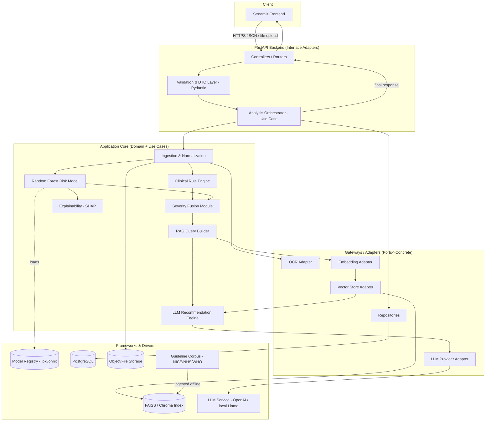
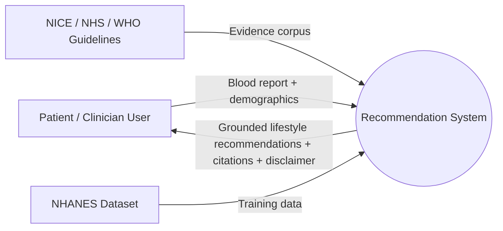
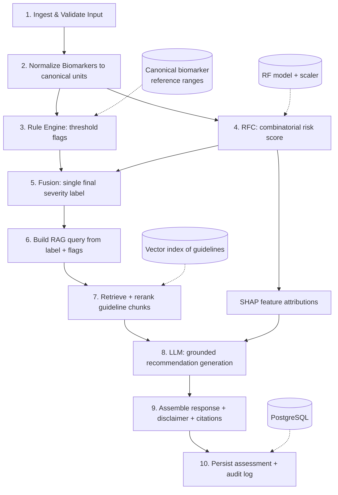
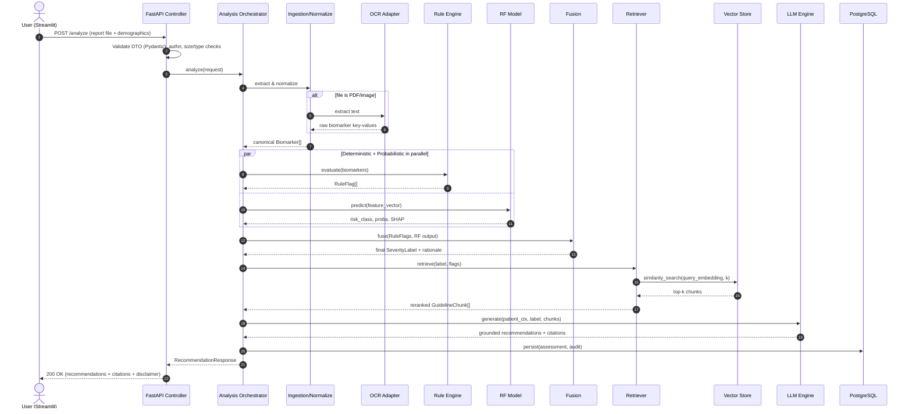
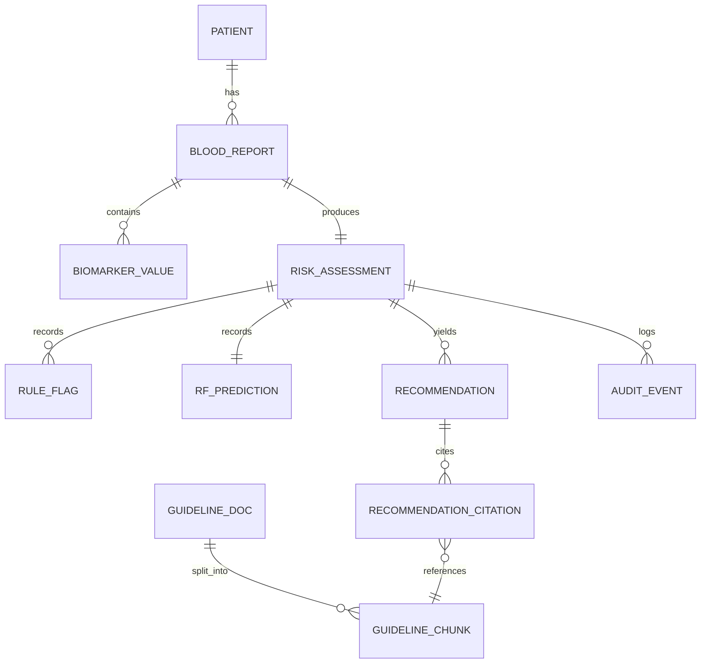

**Project:** Personalized Lifestyle Recommendation System Based on Blood Test Reports Using Machine Learning, Retrieval-Augmented Generation (RAG), and Clinical Guidelines

**Author:** Bhavesh Bhargava MSc Advance Data Science

**Document version:** 1.0

> **Clinical positioning (read first).** This system is **not** a diagnostic device. It produces **evidence-based lifestyle recommendations** grounded in NICE, NHS, and WHO guidance.

---

## 1. Design Principles

The architecture is governed by **Clean Architecture** (dependency rule: source-code dependencies point inward, toward the domain) and **SOLID**. Concretely:

| Principle | How it is applied in this system |
|---|---|
| **Single Responsibility** | The Rule Engine only evaluates thresholds; the RF model only predicts combinatorial risk; the Fusion module only merges; RAG only retrieves; the LLM layer only explains. No module does two jobs. |
| **Open/Closed** | New biomarkers or new clinical rules are added via configuration/registry, not by editing engine code. New guideline sources are added by dropping documents into the ingestion pipeline. |
| **Liskov Substitution** | `LLMProvider`, `VectorStore`, `Retriever`, and `OCRExtractor` are abstract ports; any concrete implementation (OpenAI vs. local Llama; FAISS vs. Chroma) is interchangeable. |
| **Interface Segregation** | Thin, purpose-specific ports (e.g., `IEmbedder`, `IReranker`) rather than one fat "AI service" interface. |
| **Dependency Inversion** | The domain/use-case layer depends on abstractions (ports); concrete adapters (FastAPI, FAISS, OpenAI, PostgreSQL) are injected at the boundary. |

### 1.1 Layered (Clean) view

```
┌───────────────────────────────────────────────────────────────┐
│  FRAMEWORKS & DRIVERS (outer)                                   │
│  Streamlit UI · FastAPI · PostgreSQL · FAISS/Chroma · LLM API   │
│  OCR engine · File storage · Logging/monitoring                 │
├───────────────────────────────────────────────────────────────┤
│  INTERFACE ADAPTERS                                             │
│  Controllers · DTOs/schemas (Pydantic) · Repositories ·         │
│  Gateways (LLM adapter, VectorStore adapter, OCR adapter)       │
├───────────────────────────────────────────────────────────────┤
│  APPLICATION / USE CASES                                        │
│  AnalyzeReport · EvaluateRules · PredictRisk · FuseSeverity ·   │
│  RetrieveGuidelines · GenerateRecommendation · PersistResult    │
├───────────────────────────────────────────────────────────────┤
│  DOMAIN / ENTITIES (inner, no external deps)                    │
│  Patient · Biomarker · BloodReport · RiskAssessment ·           │
│  SeverityLabel · GuidelineChunk · Recommendation                │
└───────────────────────────────────────────────────────────────┘
```

**Dependency rule:** arrows point inward only. The domain knows nothing about FastAPI, FAISS, or any LLM vendor. This is what makes the model swappable and the science reproducible.

---

## 2. Overall Architecture

The system is a **modular pipeline behind a REST API**, with a decoupled UI. There are two "brains" that run in parallel and then converge:

1. **Deterministic path — Clinical Rule Engine.** Fires on single-biomarker threshold breaches (e.g., HbA1c ≥ 48 mmol/mol → hyperglycaemia flag). Fully explainable, guideline-cited, auditable.
2. **Probabilistic path — Random Forest Classifier (RFC).** Catches *combinations* of borderline biomarkers that individually pass every rule but jointly indicate elevated risk (e.g., high-normal glucose + low HDL + high triglycerides + high waist → metabolic-risk pattern).

These two outputs are **fused into a single final severity label**. That label drives **RAG retrieval** over a guideline knowledge base, and the retrieved evidence is handed to an **LLM** that writes patient-friendly, grounded recommendations.

### 2.1 The five-stage contract (your core requirement, formalized)

```
Stage 1  Rules      → per-biomarker flags     (single-threshold breaches)
Stage 2  RFC        → combinatorial risk       (patterns no single rule catches)
Stage 3  Fusion     → ONE final severity label (max/priority merge + rationale)
Stage 4  RAG        → guideline chunks          (retrieved BY the final label)
Stage 5  LLM        → grounded explanation       (recommendations from chunks)
```

Each stage has a **stable, typed contract** (a Pydantic/domain DTO). This is what lets you unit-test stages in isolation and swap implementations — the essence of the SOLID design here.

---

## 3. Component Diagram



**Two subsystems, one offline, one online:**
- **Offline (build-time):** guideline ingestion → chunking → embedding → vector index; and NHANES training → RF model → model registry.
- **Online (request-time):** everything in the request flow (Section 8).

---

## 4. Data Flow Diagram (DFD)

### 4.1 Level 0 (context)



### 4.2 Level 1 (process decomposition)



**Key data transformations along the pipeline:**

| Step | Input | Output | Store touched |
|---|---|---|---|
| Ingest | PDF/image/manual form | Raw key-value biomarkers | File storage |
| Normalize | Raw values + units | Canonical `Biomarker` objects (SI units) | Reference-range config |
| Rules | Canonical biomarkers | List of `RuleFlag` | Rule registry |
| RFC | Feature vector | `risk_class` + probability | Model registry |
| Fusion | RuleFlags + RFC output | One `SeverityLabel` + rationale | — |
| RAG | Label + flags | Top-k `GuidelineChunk` | Vector index |
| LLM | Chunks + patient context | `Recommendation` text | LLM service |
| Persist | Full assessment | Row(s) + audit event | PostgreSQL |

---

## 5. Sequence Diagram (request-time)



**Why parallelize Rules and RFC?** They are independent (no data dependency between them), so running them concurrently reduces latency. Fusion is the join point — it is the *only* place that needs both.

---

## 6. Database Schema

PostgreSQL (relational, ACID, auditable — important for a clinical-adjacent research system). Vector storage is **not** in PostgreSQL by default; it lives in FAISS/Chroma (Section 7). Optionally, `pgvector` can consolidate both — noted as an alternative.



### 6.1 Table definitions (logical)

**patient** — demographic context (pseudonymized; no direct identifiers stored for research).
| column | type | notes |
|---|---|---|
| patient_id | UUID PK | pseudonymous |
| age | int | |
| sex | enum(M/F) | biological sex for reference ranges |
| ethnicity | varchar | affects some thresholds (e.g., waist) |
| height_cm, weight_kg | numeric | for BMI/waist derivations |
| created_at | timestamptz | |

**blood_report**
| column | type | notes |
|---|---|---|
| report_id | UUID PK | |
| patient_id | UUID FK | |
| source_type | enum(pdf,image,manual,csv) | |
| raw_file_uri | text | object storage path |
| ocr_confidence | numeric | null if manual |
| status | enum(received,processed,failed) | |
| created_at | timestamptz | |

**biomarker_value**
| column | type | notes |
|---|---|---|
| value_id | UUID PK | |
| report_id | UUID FK | |
| biomarker_code | varchar | canonical code (e.g., HBA1C, LDL, HDL, TRIG, FASTING_GLUCOSE, ALT, EGFR, HB, FERRITIN, TSH, CRP…) |
| raw_value | numeric | as reported |
| raw_unit | varchar | |
| canonical_value | numeric | after unit conversion |
| canonical_unit | varchar | SI/standard |
| ref_low, ref_high | numeric | reference range applied |
| in_range | boolean | |

**risk_assessment** — the fusion result (one per report).
| column | type | notes |
|---|---|---|
| assessment_id | UUID PK | |
| report_id | UUID FK unique | |
| final_severity | enum(low,moderate,high,urgent_referral) | the single fused label |
| fusion_rationale | text | why this label (rule vs RF contribution) |
| rule_severity | enum | max of rule flags |
| rf_severity | enum | mapped from RF class |
| model_version | varchar | RF model registry version |
| ruleset_version | varchar | rule registry version |
| created_at | timestamptz | |

**rule_flag**
| column | type | notes |
|---|---|---|
| flag_id | UUID PK | |
| assessment_id | UUID FK | |
| biomarker_code | varchar | |
| rule_id | varchar | e.g., R_HBA1C_DIABETES_RANGE |
| triggered_severity | enum | |
| guideline_ref | varchar | e.g., NICE NG28 |
| message | text | human-readable |

**rf_prediction**
| column | type | notes |
|---|---|---|
| prediction_id | UUID PK | |
| assessment_id | UUID FK | |
| predicted_class | varchar | |
| probability | numeric | |
| shap_top_features | jsonb | ranked feature attributions |

**recommendation**
| column | type | notes |
|---|---|---|
| recommendation_id | UUID PK | |
| assessment_id | UUID FK | |
| category | enum(diet,physical_activity,sleep,alcohol,smoking,stress,followup) | |
| text | text | patient-friendly |
| llm_model | varchar | provenance |
| grounded | boolean | passed groundedness check |
| created_at | timestamptz | |

**recommendation_citation**
| column | type | notes |
|---|---|---|
| citation_id | UUID PK | |
| recommendation_id | UUID FK | |
| chunk_id | UUID FK → guideline_chunk | |
| quote | text | supporting snippet |

**guideline_doc**
| column | type | notes |
|---|---|---|
| doc_id | UUID PK | |
| source | enum(NICE,NHS,WHO) | |
| title, code | varchar | e.g., NG28, CG181 |
| url, version, published_date | | provenance for reproducibility |

**guideline_chunk**
| column | type | notes |
|---|---|---|
| chunk_id | UUID PK | |
| doc_id | UUID FK | |
| chunk_text | text | |
| section_heading | varchar | |
| embedding_ref | varchar | id/pointer into FAISS/Chroma (or vector if pgvector) |
| token_count | int | |

**audit_event** — required for a trustworthy clinical-adjacent pipeline.
| column | type | notes |
|---|---|---|
| event_id | UUID PK | |
| assessment_id | UUID FK | |
| stage | enum(ingest,rules,rf,fusion,rag,llm,persist) | |
| payload | jsonb | inputs/outputs snapshot (pseudonymized) |
| latency_ms | int | per-stage timing |
| created_at | timestamptz | |

---

## 7. Technology Stack & Justification

| Layer | Technology | Why this, and why not the alternative |
|---|---|---|
| **Language** | Python 3.11+ | The only ecosystem covering ML (scikit-learn), RAG (LangChain/LlamaIndex), and web (FastAPI) in one language. Reduces context-switching for a solo MSc researcher. |
| **API framework** | **FastAPI** | Async, native Pydantic validation (enforces the typed stage contracts), auto-generated OpenAPI docs (great for a dissertation appendix). Chosen over Flask (no async/native validation) and Django (too heavyweight; ORM/admin not needed). |
| **Data validation** | **Pydantic v2** | Enforces the DTO contracts between every stage — this is how SOLID's interface segregation is made concrete and testable. |
| **Frontend** | **Streamlit** | Fastest path to a credible research UI; file upload, forms, and result display with minimal code. Chosen over React (build overhead unjustified for a single-user research demo) and Gradio (less layout control). |
| **Rule engine** | Pure-Python registry + config (YAML/JSON thresholds) | Deterministic, auditable, and **version-controllable**. A config-driven registry satisfies Open/Closed — new rules without code edits. Avoided a heavyweight BRMS (Drools) as overkill. |
| **ML model** | **scikit-learn RandomForestClassifier** | Requested; also genuinely appropriate — robust on tabular NHANES data, handles mixed features, low tuning burden, and **natively explainable** via feature importance + SHAP. Chosen over XGBoost (marginal accuracy gain, harder to justify/explain in a dissertation) and deep nets (data-hungry, opaque, unjustified on tabular data). |
| **Explainability** | **SHAP** | Turns the RF from a black box into a defensible, per-prediction explanation — essential for a clinical-adjacent, examiner-scrutinized system. |
| **Embeddings** | Sentence-Transformers (e.g., `all-MiniLM` / BGE) or provider embeddings | Local option keeps guideline processing free/offline and reproducible; provider option higher quality. Behind an `IEmbedder` port so either works. |
| **Vector store** | **FAISS** (default) or **Chroma** | FAISS: fast, local, zero-infra, perfect for a fixed guideline corpus and reproducible experiments. Chroma if metadata filtering/persistence ergonomics are preferred. Both behind a `VectorStore` port. `pgvector` noted as a consolidation option. |
| **RAG orchestration** | **LangChain** or **LlamaIndex** | Provides retrievers, chunkers, and rerankers so you compose rather than reinvent. Keep it thin and behind ports so the framework is not load-bearing (avoids lock-in). |
| **LLM** | Provider-abstracted: OpenAI/Anthropic *or* local (Llama/Mistral via Ollama) | Behind an `LLMProvider` port. Cloud for quality during development; local for a cost-free, privacy-preserving, reproducible dissertation demo. Swappable by config. |
| **Database** | **PostgreSQL** | ACID, relational integrity for the assessment/audit trail, mature, free. Optional `pgvector` to unify vectors. Chosen over SQLite (fine for dev, but Postgres shows production intent) and NoSQL (relationships here are strongly relational). |
| **ORM** | SQLAlchemy 2.0 + Alembic | Repository pattern + migrations = reproducible schema, clean separation of persistence from domain. |
| **Training data** | **NHANES** | Large, public, de-identified US population survey with labs + demographics + outcomes — ideal for training the combinatorial RF and defensible in an ethics review (no bespoke patient data collection). |
| **Testing** | pytest + coverage | Unit tests per stage (contracts make this trivial), integration tests for the pipeline. |
| **Packaging/Deploy** | Docker + docker-compose | Reproducible environment (API + DB + vector index). Deploy target: HF Spaces / Render / a VM. |
| **Config/secrets** | pydantic-settings + `.env` | Keys never hardcoded; environment-driven config supports Dependency Inversion at the boundary. |
| **Experiment tracking (optional)** | MLflow | Logs RF metrics, model versions, and RAG eval runs — strengthens the dissertation's reproducibility chapter. |

---

## 8. Module Communication & Complete Request Flow

### 8.1 How modules communicate

- **UI ↔ API:** HTTPS, JSON + multipart file upload. The UI is a *pure client*; it holds no business logic. This decoupling means the same API can later serve a mobile or web front end (Liskov at the system level).
- **Controller ↔ Use Cases:** in-process function calls with **Pydantic DTOs** as the contract. The controller never touches the domain directly — only the orchestrator use case.
- **Use Cases ↔ Domain:** the orchestrator calls domain services (Rule Engine, Fusion) that operate on pure domain entities with **no external dependencies**.
- **Use Cases ↔ External systems:** *only* through **ports** (`OCRExtractor`, `IEmbedder`, `VectorStore`, `LLMProvider`, `Repository`). Concrete adapters are injected. This is the Dependency Inversion boundary — the whole reason the LLM/vector store/model are swappable.
- **RF model & vector index:** loaded from a **registry/index at startup** (not per request) for latency; versioned so results are reproducible and auditable.
- **Persistence:** the orchestrator writes through a `Repository` port; the domain never imports SQLAlchemy.

### 8.2 End-to-end request flow (narrative)

1. **Upload.** User submits a blood report (PDF/image/manual form) + demographics via Streamlit → `POST /analyze`.
2. **Validation.** FastAPI validates file type/size and demographic DTO with Pydantic; rejects malformed input early (fail fast).
3. **Ingestion & normalization.** If PDF/image, the OCR adapter extracts biomarker key-values; values are converted to **canonical units** and mapped to canonical biomarker codes, with sex/age/ethnicity-specific reference ranges attached. Output: `Biomarker[]`.
4. **Deterministic path (Rules).** The Rule Engine evaluates each biomarker against threshold rules (guideline-cited). Output: `RuleFlag[]` — single-biomarker breaches with severities.
5. **Probabilistic path (RFC), in parallel.** The feature vector is built and the Random Forest predicts a **combinatorial** risk class + probability, catching risky *patterns* where no single rule fired. SHAP produces per-prediction attributions.
6. **Fusion.** The Fusion module merges Rule severity and RF severity into **one final `SeverityLabel`** using a priority/max policy (a rule-triggered "urgent referral" always dominates), and records a **rationale** stating which path drove the label. *This is the single source of truth for the rest of the pipeline.*
7. **RAG query.** A retrieval query is composed from the **final label + active flags + patient context**, embedded, and run against the guideline vector index; top-k chunks are retrieved and reranked. Output: `GuidelineChunk[]` with provenance (source, code, section).
8. **LLM generation.** The LLM receives patient context + final label + retrieved chunks + SHAP highlights, and generates **grounded, patient-friendly recommendations by category** (diet, activity, sleep, alcohol, smoking, stress, follow-up). Prompt constrains it to cite only retrieved evidence.
9. **Groundedness & safety pass.** Output is checked for citation coverage (every claim maps to a chunk), the mandatory **non-diagnostic disclaimer** is attached, and any red-flag label ("urgent_referral") triggers a prominent "seek medical advice" message.
10. **Persist & respond.** The full assessment + citations + per-stage audit events are written to PostgreSQL; the assembled `RecommendationResponse` returns to the UI (200 OK) and renders with citations and disclaimer.

---

## 9. Folder Structure

Clean-architecture layout; dependencies point inward. `domain` imports nothing external.

```
blood-test-lifestyle-recommender/
├── README.md
├── pyproject.toml / requirements.txt
├── docker-compose.yml
├── .env.example
├── docs/
│   ├── 01_architecture_design.md   ← this document
│   ├── diagrams/                   ← exported mermaid/PNG
│   └── dissertation/               ← chapters, figures
│
├── data/
│   ├── raw/nhanes/                 ← downloaded NHANES files
│   ├── processed/                  ← cleaned training set
│   └── guidelines/                 ← NICE/NHS/WHO source docs
│
├── src/
│   └── app/
│       ├── domain/                 ← ENTITIES (no external deps)
│       │   ├── entities.py         ← Patient, Biomarker, BloodReport…
│       │   ├── value_objects.py    ← SeverityLabel, ReferenceRange…
│       │   └── services/
│       │       ├── rule_engine.py  ← pure threshold logic
│       │       └── fusion.py       ← severity merge policy
│       │
│       ├── application/            ← USE CASES + PORTS
│       │   ├── ports/              ← abstract interfaces
│       │   │   ├── ocr.py
│       │   │   ├── embedder.py
│       │   │   ├── vector_store.py
│       │   │   ├── llm_provider.py
│       │   │   └── repositories.py
│       │   ├── dto/                ← Pydantic stage contracts
│       │   └── use_cases/
│       │       ├── analyze_report.py     ← the orchestrator
│       │       ├── retrieve_guidelines.py
│       │       └── generate_recommendation.py
│       │
│       ├── ml/                     ← RF model lifecycle
│       │   ├── features.py
│       │   ├── train.py
│       │   ├── predict.py
│       │   ├── explain.py          ← SHAP
│       │   └── registry/           ← versioned .pkl / metadata
│       │
│       ├── rag/                    ← offline + online RAG
│       │   ├── ingest.py           ← load/clean guidelines
│       │   ├── chunk.py
│       │   ├── build_index.py      ← embed → FAISS/Chroma
│       │   └── retriever.py
│       │
│       ├── adapters/               ← CONCRETE implementations of ports
│       │   ├── ocr_tesseract.py
│       │   ├── embedder_st.py
│       │   ├── vector_faiss.py
│       │   ├── llm_openai.py / llm_ollama.py
│       │   └── repo_sqlalchemy.py
│       │
│       ├── api/                    ← FastAPI (frameworks & drivers)
│       │   ├── main.py
│       │   ├── routers/analyze.py
│       │   ├── schemas.py          ← request/response DTOs
│       │   └── deps.py             ← dependency injection wiring
│       │
│       ├── config/                 ← pydantic-settings, rule/threshold YAML
│       │   ├── settings.py
│       │   └── clinical_rules.yaml
│       │
│       └── db/
│           ├── models.py           ← SQLAlchemy tables
│           └── migrations/         ← Alembic
│
├── ui/
│   └── streamlit_app.py
│
├── tests/
│   ├── unit/                       ← per-stage (rules, fusion, features…)
│   ├── integration/                ← full pipeline
│   └── eval/                       ← RAG + recommendation evaluation
│
└── scripts/
    ├── download_nhanes.py
    ├── train_model.py
    └── build_vector_index.py
```

---

## 10. Potential Challenges & Solutions

| # | Challenge | Risk | Solution / mitigation |
|---|---|---|---|
| 1 | **OCR unreliability** on scanned/photographed reports | Wrong biomarker values → wrong everything downstream | Confidence thresholds; require manual confirmation of extracted values in the UI before analysis; support a manual-entry and CSV path so OCR is optional. |
| 2 | **Unit heterogeneity** (mg/dL vs mmol/L; HbA1c % vs mmol/mol) | Silent misclassification | Canonical-unit normalization layer with an explicit conversion table; reject unknown units rather than guess. |
| 3 | **LLM hallucination / ungrounded advice** | Clinical-safety and dissertation-credibility failure | Strict RAG grounding; prompt forbids un-cited claims; automated **groundedness check** (claim→chunk mapping); low temperature; refuse-and-signpost fallback when evidence is insufficient. |
| 4 | **RF trained on NHANES (US) applied with NICE/NHS (UK) thresholds** | Population/label mismatch | Keep the RF as a *risk-pattern* detector, not a diagnostic; anchor all clinical thresholds/labels in the deterministic rule engine (UK guidelines); document this design boundary explicitly in the dissertation. |
| 5 | **Class imbalance** in NHANES risk labels | RF biased to majority class | Stratified splits, class weights / resampling (SMOTE), and report **balanced** metrics (macro-F1, PR-AUC) not just accuracy. |
| 6 | **Defining the RF target label** (NHANES has no "lifestyle severity" column) | Weak, indefensible ground truth | Derive a transparent composite risk label from established indices (e.g., metabolic-syndrome criteria, cardiometabolic markers) and document the labeling rule fully — this becomes a methods contribution. |
| 7 | **Fusion conflicts** (rules say low, RF says high, or vice versa) | Ambiguous final label | Explicit, documented **priority policy**: safety-dominant (max severity wins); rule-triggered urgent referral always overrides; store `fusion_rationale` for auditability. |
| 8 | **Guideline corpus drift / provenance** | Recommendations cite outdated guidance | Version + date every `guideline_doc`; rebuild index as a tracked artifact; cite source code + version in every recommendation. |
| 9 | **Latency** (OCR + RF + embedding + retrieval + LLM) | Poor UX | Load model/index at startup; run Rules and RF in parallel; cache embeddings of the fixed corpus; stream LLM output. |
| 10 | **Data privacy / ethics** | Handling health data | Pseudonymize; store no direct identifiers; NHANES is de-identified/public; explicit consent + disclaimer in UI; document in the ethics chapter. |
| 11 | **Evaluation of a generative system** | Hard to grade "good advice" objectively | Multi-pronged (Phase 9): RF classification metrics; RAG retrieval metrics (recall@k, MRR); groundedness/faithfulness scoring; and a small clinician/rubric-based human eval. |
| 12 | **Reproducibility for examiners** | "Works on my machine" | Docker-compose for the whole stack; pinned deps; versioned model + index artifacts; optional MLflow tracking. |

---

## 11. Traceability: your five requirements → this design

| Your requirement | Where it lives |
|---|---|
| 1. Rules handle single biomarker threshold breaches | `domain/services/rule_engine.py`; `rule_flag` table; config `clinical_rules.yaml` |
| 2. RFC handles combinations where no single rule fires | `ml/predict.py`; `rf_prediction` table |
| 3. Two outputs merge into one final severity label | `domain/services/fusion.py`; `risk_assessment.final_severity` + `fusion_rationale` |
| 4. RAG retrieves guidelines based on that final label | `rag/retriever.py`; query built from `final_severity` + flags |
| 5. LLM generates explanation | `application/use_cases/generate_recommendation.py`; `recommendation` + `recommendation_citation` |

---

## 12. Phase 1 Exit Criteria (what "done" means)

- [x] Layered clean-architecture design with enforced dependency rule
- [x] Component, data-flow, and sequence diagrams
- [x] Relational schema with full audit trail
- [x] Folder structure mapping 1:1 to the architecture
- [x] Technology choices justified against alternatives
- [x] Module communication + end-to-end request flow documented
- [x] Challenges and mitigations catalogued
- [x] The five-stage contract (Rules → RFC → Fusion → RAG → LLM) formalized

**Ready to proceed to Phase 2 (NHANES Data Preparation) on approval.**
